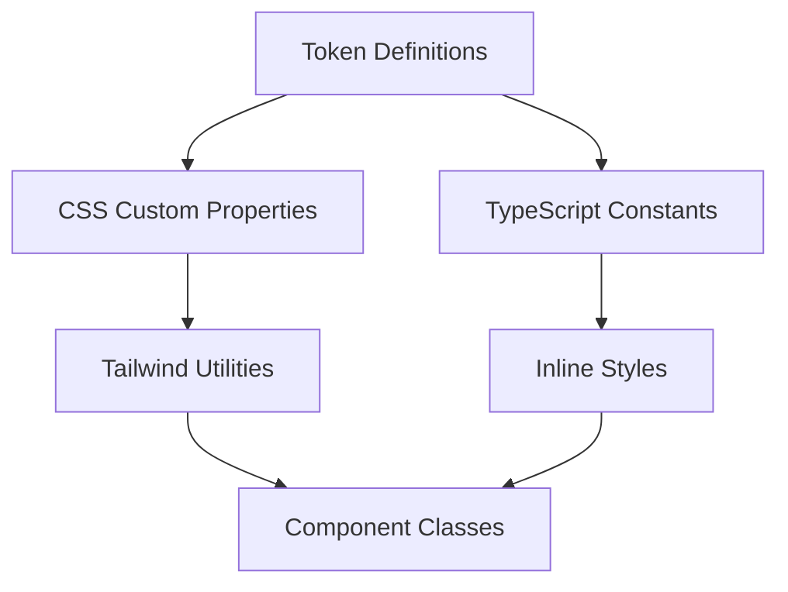

# AudioBlocks Theme Token System

This document serves as the comprehensive reference for the AudioBlocks theme token system, providing a single source of truth for all design tokens used across the application.

## Overview

The AudioBlocks theme token system establishes a consistent design language through semantic color tokens that automatically adapt to light and dark themes. This system replaces hardcoded hex values with semantic tokens that provide:

- **Consistency**: Uniform color usage across all components
- **Maintainability**: Centralized token definitions for easy updates
- **Accessibility**: Automated contrast ratios and theme switching
- **Brand Alignment**: Easy rebranding without component changes

## Token Architecture

### Core Principles

1. **Semantic Naming**: Tokens are named for their purpose (e.g., `primary`, `surface`, `text`) rather than literal color values
2. **Theme Agnostic**: Components reference tokens without knowledge of the active theme
3. **CSS/JS Synchronization**: Tokens are defined in both CSS custom properties and TypeScript constants

### Implementation Layers



## Token Catalog

### Primary Colors

| Token | Light Theme | Dark Theme | Usage |
|-------|-------------|------------|-------|
| `primary` | `#D2045B` (brand pink) | `#E83A87` | Primary actions, links, brand accent |
| `primary-hover` | `#B8043F` | `#FF5BA0` | Hover state for primary elements |
| `primary-contrast` | `#FFFFFF` | `#FFFFFF` | Text/icons on primary surfaces |

### Secondary Colors

| Token | Light Theme | Dark Theme | Usage |
|-------|-------------|------------|-------|
| `secondary` | `#885FA8` (purple) | `#A87BC2` | Secondary actions, decorative accents |
| `secondary-contrast` | `#FFFFFF` | `#FFFFFF` | Text/icons on secondary surfaces |

### Surface Colors

| Token | Light Theme | Dark Theme | Usage |
|-------|-------------|------------|-------|
| `background` | `#FFFFFF` | `#000000` | Page-level background |
| `surface` | `#FFFFFF` | `#161616` | Cards, panels, dialogs |
| `surface-raised` | `#F7F7F7` | `#1E1E1E` | Hovered/elevated surfaces |
| `surface-sunken` | `#F0F0F0` | `#0F0F0F` | Input fields, code blocks |

### Text Colors

| Token | Light Theme | Dark Theme | Usage |
|-------|-------------|------------|-------|
| `text` | `#111111` | `#FFFFFF` | Default body copy |
| `text-muted` | `#6F6F6F` | `#A3A3A3` | Captions, helpers, secondary text |
| `text-subtle` | `#9CA3AF` | `#6F6F6F` | Disabled text, placeholders |
| `text-inverted` | `#FFFFFF` | `#000000` | Text on inverse backgrounds |

### Border Colors

| Token | Light Theme | Dark Theme | Usage |
|-------|-------------|------------|-------|
| `border` | `#E5E5E5` | `#2A2A2A` | Default borders, dividers |
| `border-subtle` | `#F0F0F0` | `#1F1F1F` | Very faint dividers, subtle separation |

### Status Colors

| Token | Light Theme | Dark Theme | Usage |
|-------|-------------|------------|-------|
| `success` | `#3DDC84` | `#3DDC84` | Success states, positive feedback |
| `warning` | `#FFB020` | `#FFB020` | Warning states, cautions |
| `error` | `#FF5252` | `#FF7B7B` | Errors, destructive actions |
| `info` | `#4F8DFF` | `#4F8DFF` | Informational messages |

## Technical Implementation

### CSS Custom Properties

Tokens are defined as CSS custom properties in `app/src/app/globals.css` under the `@theme inline` directive:

```css
@theme inline {
  /* Light theme (default) */
  --color-primary: #D2045B;
  --color-primary-hover: #B8043F;
  --color-primary-contrast: #FFFFFF;
  /* ... other tokens */
  
  /* Dark theme overrides */
  .dark {
    --color-primary: #E83A87;
    --color-primary-hover: #FF5BA0;
    /* ... other dark theme tokens */
  }
}
```

### TypeScript Constants

Corresponding TypeScript constants are defined in `app/src/theme/colors.ts`:

```typescript
export const colorTokens = {
  primary: {
    default: "var(--color-primary)",
    hover: "var(--color-primary-hover)",
    contrast: "var(--color-primary-contrast)",
  },
  // ... other token groups
} as const;
```

### Theme Switching

Theme switching is handled by toggling a `.dark` class on the `<html>` element:

```typescript
// Toggle dark mode
document.documentElement.classList.toggle('dark');
```

The `TopHeader.tsx` component manages this toggle, and all token values automatically update through CSS variable overrides.

## Usage Guidelines

### Preferred: Tailwind Utilities

Tailwind v4 automatically generates utility classes from CSS custom properties:

```tsx
// ✅ Preferred - uses generated Tailwind classes
<button className="bg-primary hover:bg-primary-hover text-primary-contrast">
  Save
</button>

// ❌ Avoid - hardcoded hex values
<button className="bg-[#D2045B] hover:bg-[#B8043F] text-white">
  Save
</button>
```

### Acceptable: Inline Styles

For dynamic styles or non-Tailwind contexts:

```tsx
import { colorTokens } from "@/theme/colors";

<div style={{ 
  backgroundColor: colorTokens.surface.default,
  borderColor: colorTokens.border.default 
}} />
```

### Charts and Canvas

For SVG, canvas, or chart libraries:

```tsx
import { colorTokens } from "@/theme/colors";

<Line 
  data={data}
  options={{
    borderColor: colorTokens.primary.default,
    backgroundColor: colorTokens.surface.sunken
  }}
/>
```

## Adding New Tokens

### Step 1: Define CSS Custom Property

Add the token to `app/src/app/globals.css` under both `:root` and `.dark` contexts:

```css
@theme inline {
  --color-new-token: #HEX_VALUE;
  
  .dark {
    --color-new-token: #DARK_HEX_VALUE;
  }
}
```

### Step 2: Add TypeScript Constant

Add the corresponding entry in `app/src/theme/colors.ts`:

```typescript
export const colorTokens = {
  // ... existing tokens
  newToken: "var(--color-new-token)",
} as const;
```

### Step 3: Update Documentation

1. Add the token to the catalog table in this document
2. Update `app/src/theme/README.md` if applicable
3. Consider updating `docs/theme-adoption-status.md` for tracking

## Token Naming Conventions

### Structure
```
{category}-{variant}-{state?}
```

### Categories
- `primary`, `secondary`: Brand and action colors
- `background`, `surface`: Layout and container colors
- `text`: Typography colors
- `border`: Border and divider colors
- `success`, `warning`, `error`, `info`: Status colors

### Variants
- `default`: Primary variant
- `hover`, `active`, `focus`: Interactive states
- `contrast`: Text color for contrast
- `muted`, `subtle`: Reduced emphasis
- `raised`, `sunken`: Elevation levels

## Accessibility Considerations

### Contrast Ratios
All token pairs meet WCAG 2.1 AA contrast requirements:
- Text on background: ≥ 4.5:1
- Large text on background: ≥ 3:1
- UI components: ≥ 3:1

### Theme Switching
- Supports user preference via `prefers-color-scheme`
- Manual toggle preserved in localStorage
- Smooth transitions to prevent flash

## Related Documentation

- [`app/src/theme/README.md`](../app/src/theme/README.md) - Component-level usage guide
- [`app/src/theme/colors.ts`](../app/src/theme/colors.ts) - TypeScript token definitions
- [`docs/theme-adoption-status.md`](./theme-adoption-status.md) - Token adoption tracking

## Maintenance

### Synchronization Checklist
When making token changes:
- [ ] Update CSS custom properties in `globals.css`
- [ ] Update TypeScript constants in `colors.ts`
- [ ] Update this documentation
- [ ] Update component-level README if needed
- [ ] Verify contrast ratios remain compliant
- [ ] Test in both light and dark themes

### Breaking Changes
Major token changes (renaming, removing, significant value shifts) require:
1. Update all consuming components
2. Run comprehensive visual regression tests
3. Update Storybook stories
4. Communicate changes to the team

## Version History

| Date | Version | Changes |
|------|---------|---------|
| Initial | 1.0.0 | Initial token system implementation |
| | | Referenced from `app/src/theme/colors.ts` |

---

*This document is the authoritative reference for the AudioBlocks theme token system. All token usage should align with the patterns and guidelines established here.*